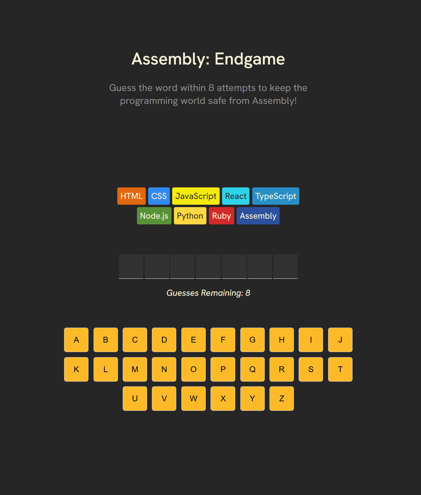
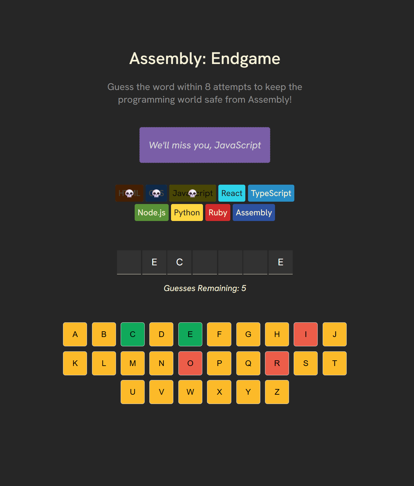
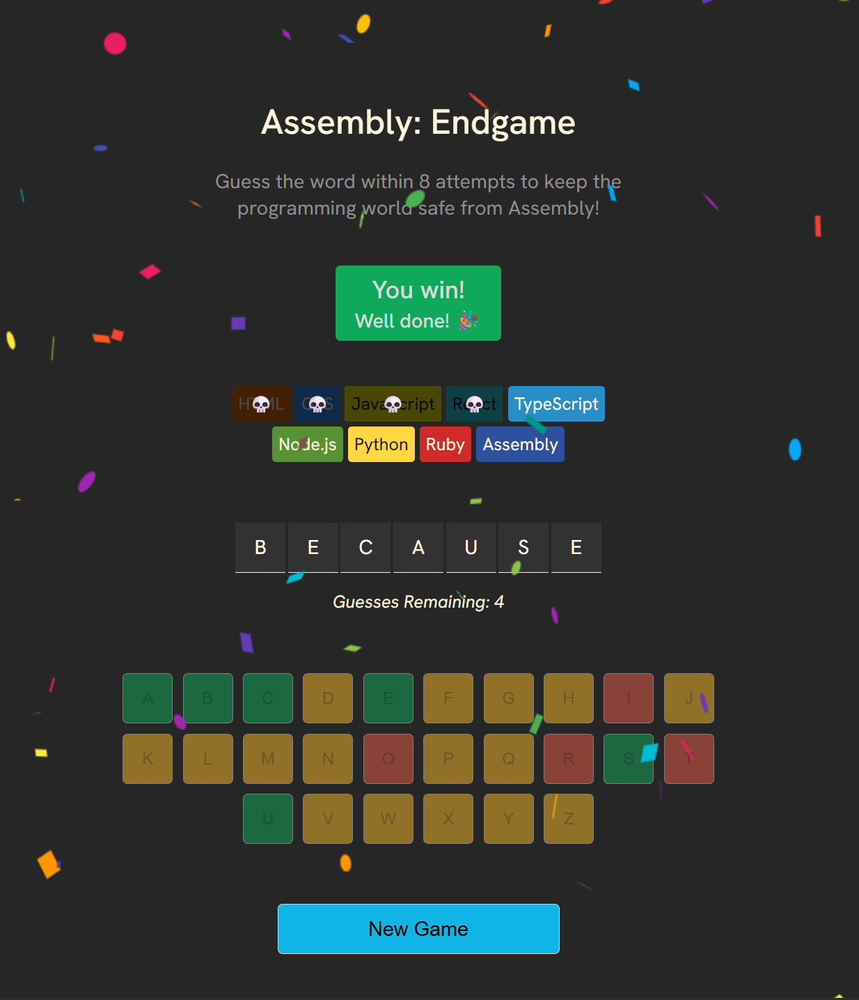

# Assembly - Endgame 🤖

**Assembly - Endgame** is a thrilling word-guessing game built with React, where your mission is to protect the programming world from being overtaken by Assembly. Guess the word correctly within 8 attempts — or watch as each incorrect guess wipes out a beloved programming language from existence.

---

## 🎮 Game Objective

Your goal is to **guess the hidden word in under 8 incorrect attempts**. Every incorrect guess results in the extinction of a programming language. If all 8 are gone, **Assembly reigns supreme**, and you lose the game.

---

## 🧠 Gameplay Mechanics

- 🧩 **Word Display**: A random word is chosen at the start. All letters are hidden initially.
- ⌨️ **On-Screen Keyboard**: Use the provided virtual keyboard to guess letters.
  - Correct guess:
    - The guessed letter appears in the word display.
    - The keyboard key turns **green**.
  - Incorrect guess:
    - The key turns **red**.
    - A programming language card is overlaid with a **skull icon**.
    - A message appears in the **status section** describing the tragedy.
- ☠️ **Lose Condition**: 8 incorrect guesses means all languages except Assembly are gone. The game shows a **"You Lose"** message and reveals the word.
- 🎉 **Win Condition**: Successfully guess the word before 8 wrong attempts. You’ll see a **"You Win"** message and celebratory **confetti**.
- 🔁 **Replay**: After either outcome, a **"New Game"** button appears to start a new round.

---

## 🛠️ Technologies

- **Vite**: Lightning-fast development and build tool.
- **React.js**: For building the interactive UI and managing game state.
- **JavaScript (ES6+)**: Game logic and event handling.
- **HTML5**: Structuring the game layout.
- **CSS3**: For skull overlays, button color changes, and overall app design. 

## 📸 Preview






## 📽️ Demo
Check out the live demo of the Assembly - Endagame App [here](https://the1fatkid.github.io/assembly-endgame/).

## 🚀 Getting Started
To set up the project locally for development and testing, follow these steps:

1. **Clone the Repository**:
    ```bash
    git clone https://github.com/the1fatkid/assembly-endgame.git
    ```

2. **Navigate to the Project Directory**:
    ```bash
    cd assembly-endgame
    ```

3. **Install Dependencies**:
    ```bash
    npm install
    ```

4. **Start the Development Server**:
    ```bash
    npm run dev
    ```

5. **Open the App**:
   Visit `http://localhost:5173` (or the URL specified by Vite) in your browser to interact with the app.

<br><br>

*Thanks for checking out my Assembly - Endgame App! Have fun playing! 😄*   

